[中文使用手冊](docs/user-guide.md) | [English](#ht32-project-assistant-for-vs-code)

# HT32 Project Assistant for VS Code

A VS Code extension for **Holtek HT32** series Cortex-M microcontrollers (M0+/M3/M4). Converts Keil uVision and HT32-IDE projects to a Makefile workflow, or creates new projects from scratch — with one-click build, flash, and debug via the bundled OpenOCD and e-Link32 probe.

---

## Features

| Feature | Description |
|---------|-------------|
| **Create Project** | Wizard-driven project generator from HT32 FWLib (standard & 49x series) |
| **Convert uVision** | Import Keil `.uvprojx` / `.uvmpw` projects — Makefile, linker script, clangd config auto-generated |
| **Convert HT32-IDE** | Import Eclipse CDT `.project`/`.cproject` projects |
| **Build / Clean** | One-click or toolbar buttons; compound post-build task support |
| **Download (Flash)** | Flash firmware via bundled OpenOCD + e-Link32 Pro/Lite |
| **Debug** | Cortex-Debug + bundled OpenOCD; Flash & Debug or Attach mode |
| **HT32 Settings** | WebView panel for compiler flags, debug interface, post-build commands |
| **Project File Tree** | Source groups view with add/remove files and groups |
| **clangd / IntelliSense** | Auto-generates `.clangd` and merged `compile_commands.json` |
| **Configuration Wizard** | Visual editor for HT32 config files (`conf.h`, `system_ht32.c`, `usbdconf.h`, `startup.s`) — Keil-compatible wizard syntax |

---

## Requirements

| Item | Description |
|------|-------------|
| **OS** | Windows x64 |
| **Debug probe** | Holtek e-Link32 Pro or e-Link32 Lite (recommended); J-Link and ST-Link also supported |
| **FWLib** | Required; supports HT32F1xxxx / HT32F4xxxx / HT32F5xxxx / HT32F490x1 / HT32F491x3 / HT32F493x5 |

> **GCC toolchain:** Auto-detected on startup; installed automatically via winget if not found, or set manually in settings.<br>
> **OpenOCD:** Bundled — no separate installation needed.<br>
> **Extension dependencies:** [Cortex-Debug](https://marketplace.visualstudio.com/items?itemName=marus25.cortex-debug) and [Holtek Configuration Wizard](https://marketplace.visualstudio.com/items?itemName=holtek-semi.ht32-config-wizard) are installed automatically.

---

## Installation

**Option A — From VSIX**

1. VS Code → Extensions → `...` → **Install from VSIX...**
2. Select `ht32-proj-assistant-x.x.x.vsix`

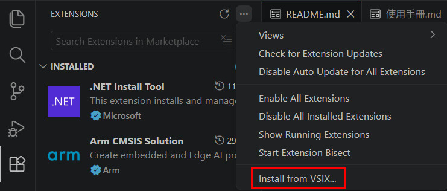 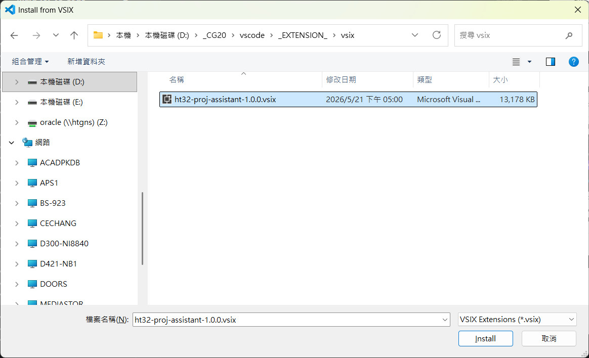

---

**Option B — From Marketplace**

1. Search `Holtek Project Assistant` in the Extensions view
2. Click **Install**

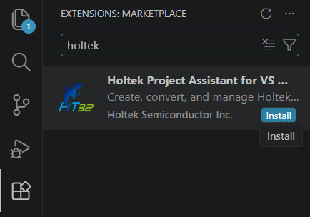

---

## Interface Overview

After installation, the **HT32 icon** appears in the Activity Bar. Click it to open the HT32 panel.

**When no project is open:** shows **Create / Open / Convert** buttons, plus a **Recent Projects** list below for quick access.

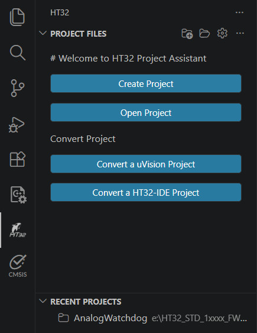

---

**Toolbar buttons (visible when a project is loaded):**

| Button | Action |
|--------|--------|
| Build | Compile (runs make) |
| Debug | Start Cortex-Debug session via OpenOCD |
| Clean | Delete the `build/` output directory |
| Download | Flash firmware without starting a debug session |
| Settings | Open HT32 Settings WebView |
| `{}` Generate Config | Regenerate `tasks.json` and `launch.json` |

---

**Project File Tree** (bottom of the HT32 panel) shows source groups — the same group concept as Keil uVision.

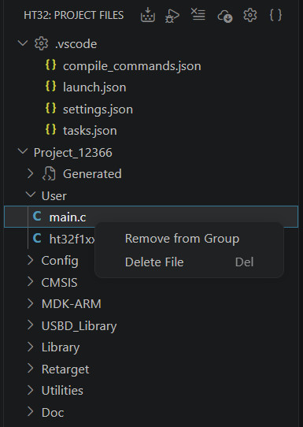

Right-click menu:

| Target | Actions |
|--------|---------|
| Project root | Add group |
| Group | Add file, Remove group |
| File | Remove from group, Delete from disk |

---

## Getting Started

### Create a New Project

> Requires HT32 FWLib downloaded from the Holtek website.

1. Click the **HT32** icon in the Activity Bar → **Create Project** (the `+` button)
2. Follow the wizard:

| Step | Action |
|------|--------|
| ① | Select the **HT32 FWLib root folder** |
| ② | Choose **MCU model** |
| ③ | Choose output type: **Application** or **Library** |
| ④ | Enter **project name** and save location |

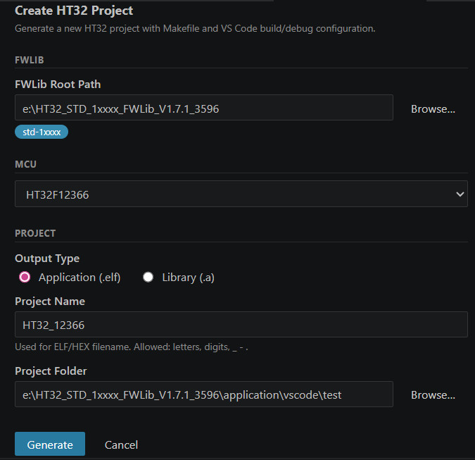

---

### Generated File Structure

```
<workspace>/
├── .clangd
├── src/
│   ├── main.c
│   ├── ht32fxxxx_it.c
│   ├── system_ht32fxxxx.c
│   ├── ht32fxxxx_conf.h
│   └── ht32_op.c
└── .vscode/
    ├── tasks.json
    ├── launch.json
    ├── compile_commands.json
    └── build-gen/
        ├── Makefile
        ├── linker_script.ld
        ├── startup_ht32fxxxx_gcc_xx.s
        ├── ht32_syscalls.c
        ├── ht32_retarget_gnu.c
        └── *.json
```

> **49x series** (HT32F490x / 491x / 493x): `src/` includes board support files (`ht32fXXXxX_board.c/h`) instead of `ht32_op.c`.

---

### Convert a Keil uVision Project

1. Click **Convert uVision Project** in the HT32 panel
2. Select the `.uvprojx` (single project) or `.uvmpw` (multi-project workspace) file

For `.uvmpw`, **all sub-projects are converted at once**, each into its own `.vscode/build-gen-{project-name}/` directory.

**Auto-generated:**
- `Makefile` (MCU, compiler flags, source files)
- `linker_script.ld` (converted from Keil scatter file)
- `startup_xxx_gcc.s` (converted from Keil startup)
- `compile_commands.json` / `tasks.json` / `launch.json`

**Single `.uvprojx`** — output to `.vscode/build-gen/`

**`.uvmpw` multi-project** — one directory per sub-project, e.g. `Project_IAP.uvprojx` + `Project_AP.uvprojx`:

```
.vscode/
├── tasks.json
├── launch.json
├── build-gen-iap/
│   ├── Makefile
│   ├── linker_script.ld
│   └── *.json
└── build-gen-ap/
    ├── Makefile
    ├── linker_script.ld
    └── *.json
```

Conversion warnings (e.g. prebuilt `.lib` files that cannot be used with GCC) appear in the VS Code **Problems** panel.

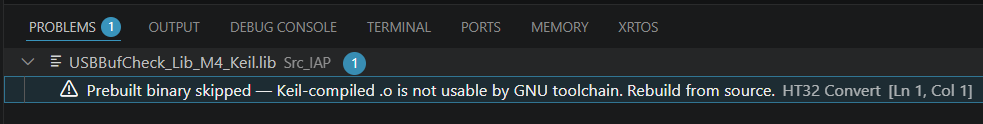

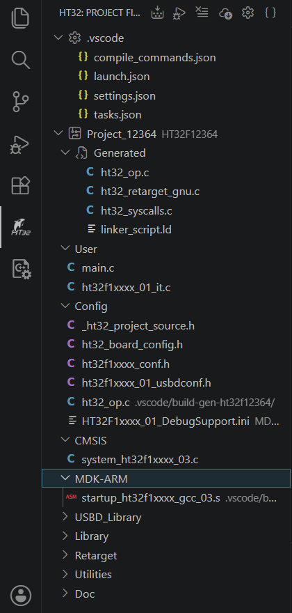

---

### Convert an HT32-IDE Project

1. Click **Convert HT32-IDE Project** in the HT32 panel
2. Select the project folder containing `.project` / `.cproject` (Eclipse CDT format)

If the folder contains multiple sub-projects, all are converted at once, each into its own `build-gen-{suffix}/` directory. Conversion warnings appear in the VS Code **Problems** panel.

---

## Build

- Click **Build** in the HT32 toolbar
- Or press **Ctrl+Shift+B** to access VS Code tasks (Build, Build All, Clean, Download)

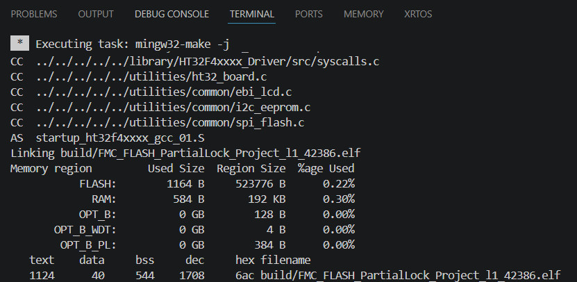

A **Post-Build** command can be configured in Settings to run automatically after a successful build (e.g. CRC calculation).

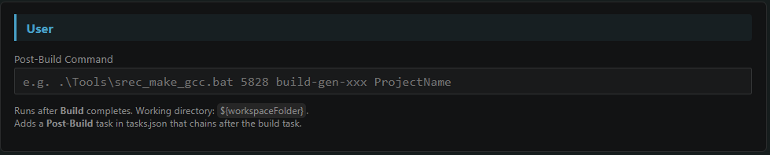

---

## Clean

- Click **Clean** in the HT32 toolbar
- Deletes all compiled output under `.vscode/build-gen/build/`

---

## Flash Firmware

> Requires Holtek e-Link32 Pro or e-Link32 Lite connected.

1. Confirm the e-Link32 is connected and the driver is working
2. Click **Download** in the HT32 toolbar
3. Firmware is flashed automatically; progress is shown in the Terminal

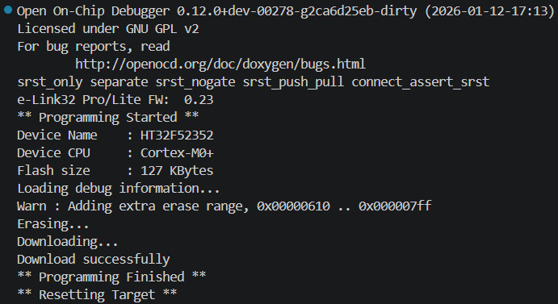

### Flash Settings (configured in HT32 Settings)

| Setting | Options |
|---------|---------|
| Debug Interface | CMSIS-DAP (e-Link32) / J-Link / ST-Link |
| Erase Mode | Erase Sector (default) / Erase Chip / None |

---

## Debug

> **Cortex-Debug** is a dependency and is installed automatically.

### Full Debug Flow

1. Click **Debug** in the HT32 toolbar
2. The extension compiles, flashes, and starts an OpenOCD + GDB debug session

### Attach Mode (connect to an already-running target)

Use this when the target board is already running and you don't need to reflash.

1. Confirm the target board is powered and running
2. Press **F5** or open Run and Debug (**Ctrl+Shift+D**)
3. Select **HT32 OpenOCD Attach** from the dropdown, then press ▶

> Attach does not compile or flash — it connects directly via OpenOCD and halts the CPU.

| Mode | Description |
|------|-------------|
| HT32 OpenOCD Debug | Compile → Flash → Start debug session |
| HT32 OpenOCD Attach | Connect to running target without flashing |

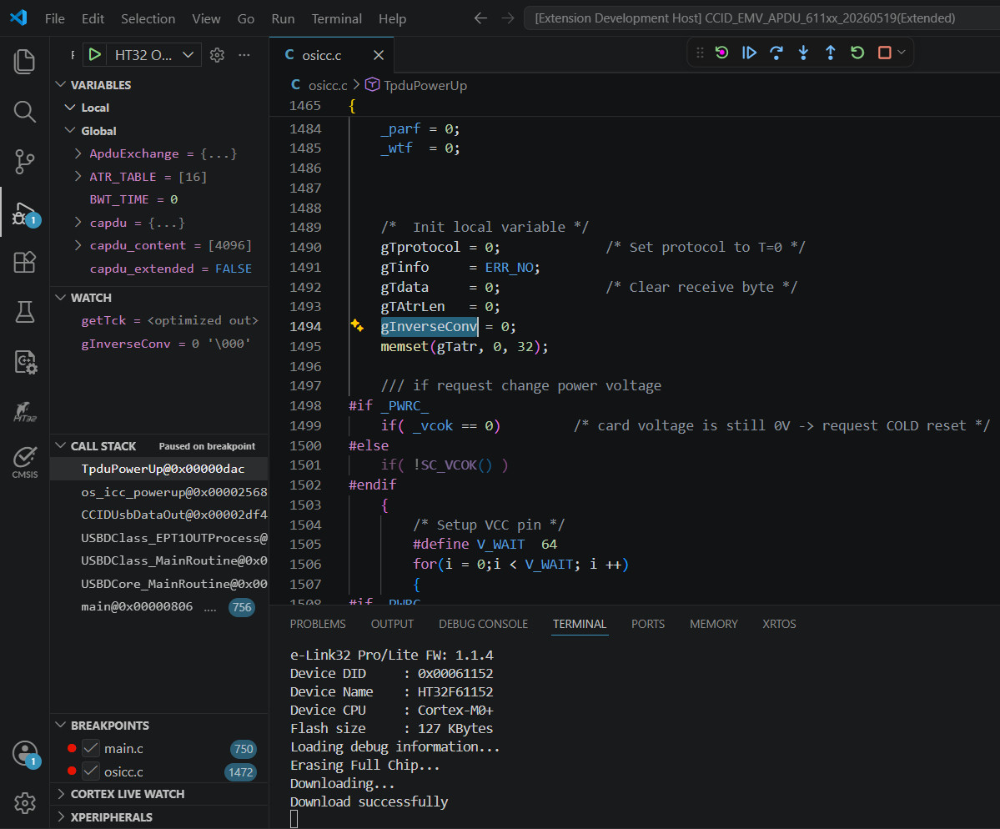

---

## HT32 Settings

Open via the **Settings** button (⚙️) in the HT32 toolbar. Settings are stored in `.vscode/build-gen/project.settings.json` and auto-save after 3 seconds.

### Compiler

| Setting | Options |
|---------|---------|
| Optimization | `-O0` / `-O1` / `-O2` / `-O3` / `-Os` (default) / `-Og` |
| Debug Info | `-g3` (default, full debug) / `-g` (standard) / `-g1` (line numbers only) / `-g0` (none, for release) |
| Float ABI | `soft` (M0/M3) / `softfp` / `hard` (M4F) |
| FPU | `none` / `fpv4-sp-d16` (M4F) / `fpv5-sp-d16` (M7) / `fpv5-d16` (M7) |
| C Runtime | `nano` (newlib-nano) / `nosys` — can combine both |
| LTO | Enable `-flto` |
| Extra CFLAGS | Additional compiler flags, e.g. `-DDEBUG` |
| Extra LDFLAGS | Additional linker flags |
| printf float | Enable floating-point printf (`-u _printf_float`) |
| scanf float | Enable floating-point scanf (`-u _scanf_float`) |


---

## Settings — Libraries & Other

### Extra Libraries

| Setting | Description |
|---------|-------------|
| Extra Libs | Direct-link `.a` / `.o` file paths |
| Extra Lib Names | Library names (`-lName`) |
| Extra Lib Paths | Library search paths (`-L"dir"`) |

### Other

| Setting | Description |
|---------|-------------|
| Output Name | Override the output filename |
| SVD File | Peripheral register SVD file (blank = auto-detect) |
| DFP Path | Custom DFP path |
| Post-Build | Command to run after a successful build |

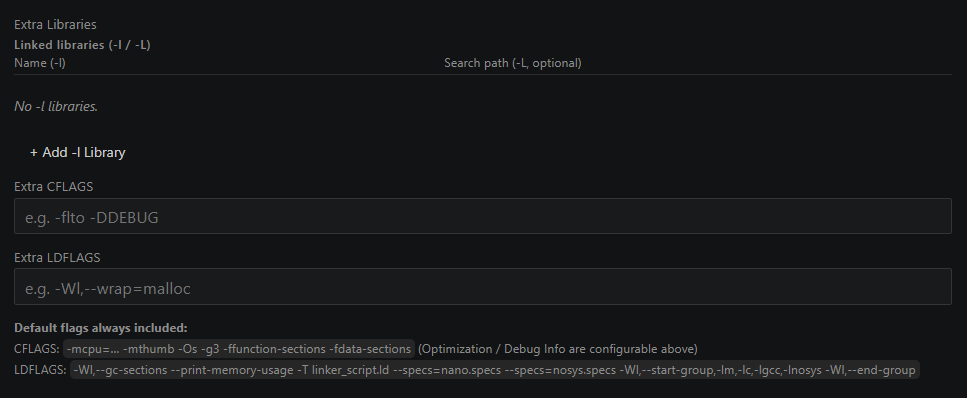

---

## Settings — Debug / Flash

| Setting | Options |
|---------|---------|
| Debug Interface | `CMSIS-DAP` (e-Link32) / `J-Link` / `ST-Link` |
| Adapter Serial | Specify probe serial (blank = auto) |
| Adapter Speed | Transfer rate in kHz (blank = interface default) |
| Erase Mode | `erase_sector` (default) / `erase_chip` / `none` |
| Flash Loaders | Add external flash loaders (e.g. SPI Flash) |
| OpenOCD Debug Level | 0 = off / 1–3 = increasing verbosity |

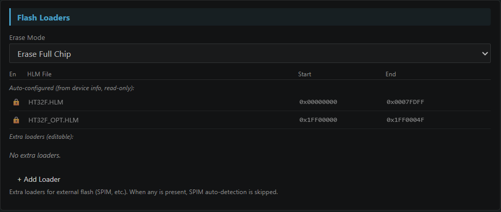
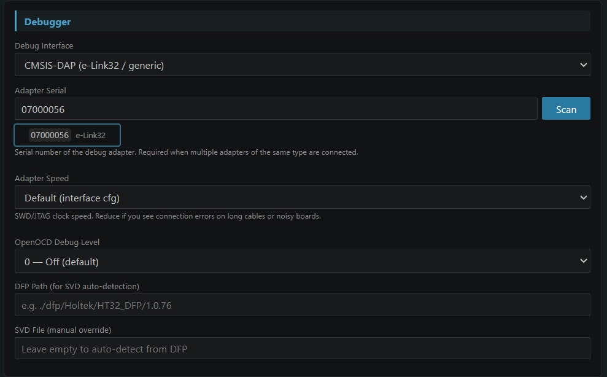

---

## Settings — Toolchain (Global)

Stored in VS Code machine settings, shared across all projects:

| Setting | Description |
|---------|-------------|
| GCC Path | `arm-none-eabi-gcc` path (blank = auto-detect or winget install) |
| Make Path | `make` path (blank = use bundled Make) |
| OpenOCD Path | OpenOCD path (blank = use bundled OpenOCD) |

---

## Configuration Wizard

The **Holtek Configuration Wizard** extension (installed automatically) provides a visual editor for HT32 firmware configuration files, compatible with Keil MDK Configuration Wizard syntax.

**Supported files:**

| File | Purpose |
|------|---------|
| `ht32fxxxx_conf.h` | Retarget (printf/scanf port, baudrate, library enable) |
| `system_ht32fxxxx_NN.c` | Clock (PLL, HSE/HSI, HCLK, WDT) |
| `ht32fxxxx_NN_usbdconf.h` | USB endpoint configuration |
| `startup_ht32fxxxx_NN.s` | Stack and heap size |

**How to open:**

- **Editor title button (recommended):** Open a supported `.h` / `.c` / `.s` file, then click the **Preview** button in the editor title bar. Click **Go to File** to switch back to text editing.
- **Right-click menu:** Right-click the file in Explorer → **Open in Holtek Configuration Wizard**
- **Command Palette:** `Ctrl+Shift+P` → **HT32: Open in Holtek Configuration Wizard**

**Control types:**

| Type | Description |
|------|-------------|
| Checkbox (`<q>`) | Toggle on/off |
| Dropdown (`<o>` with options) | Select from predefined list |
| Number (`<o>` with range) | Enter value within allowed range |
| Enable Section (`<e>`) | Master switch that enables/disables a group of settings |
| Heading (`<h>`) | Collapsible group |

Changes are written back to the source file immediately; only the modified value is updated — all comments and surrounding code are preserved.

---

## IntelliSense (clangd)

After conversion or project creation, the extension auto-generates:

- `.clangd` (workspace root) — include paths, compiler flags
- `.vscode/compile_commands.json` — merged for clangd

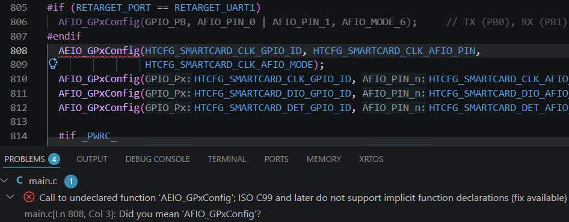
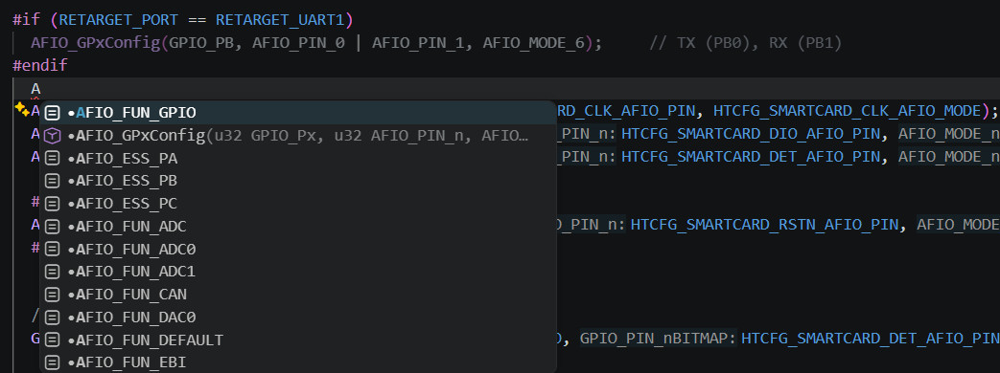

Recommended: install the **clangd** extension (`llvm-vs-code-extensions.vscode-clangd`) and disable the built-in C/C++ IntelliSense to avoid conflicts.

---

## Output Structure

After conversion or project creation:

```
<workspace>/
├── .clangd                       ← clangd config (workspace root)
├── src/                          ← User source files
│   ├── main.c
│   ├── ht32fxxxx_it.c
│   └── ...
└── .vscode/
    ├── tasks.json
    ├── launch.json
    ├── compile_commands.json     ← Merged for clangd
    └── build-gen/
        ├── Makefile
        ├── linker_script.ld
        ├── startup_xxx.s
        ├── ht32_syscalls.c
        ├── ht32_retarget_gnu.c
        ├── compile_commands.json
        ├── sources.list
        ├── project.meta.json
        ├── project.settings.json
        └── build.meta.json
```

---

## Commands (Ctrl+Shift+P → "HT32")

| Command | Description |
|---------|-------------|
| `HT32: Create Project` | Open Create Project wizard |
| `HT32: Open Project` | Open an existing HT32 project folder |
| `HT32: Convert uVision Project` | Import Keil `.uvprojx` / `.uvmpw` |
| `HT32: Convert HT32-IDE Project` | Import Eclipse CDT `.project` |
| `HT32: Build` | Run build task |
| `HT32: Download` | Flash firmware |
| `HT32: Debug` | Start debug session |
| `HT32: Clean` | Clean build output |
| `HT32: Open Settings` | Open HT32 Settings WebView |
| `HT32: Generate Build & Debug Config` | Regenerate `tasks.json` and `launch.json` |

---

## Supported Devices

141 HT32 devices across 6 series:

| Core | Series | Examples |
|------|--------|---------|
| Cortex-M0+ | HT32F5xxxx | HT32F52352, HT32F52341, HT32F0008 |
| Cortex-M0+ | HT32F5xxxx (extended) | HT32F61352, HT32F62030, HT32F67232 |
| Cortex-M3 | HT32F1xxxx | HT32F12345, HT32F12366 |
| Cortex-M4 | HT32F4xxxx | HT32F40316, HT32F45369 |
| Cortex-M4 | HT32F490x / 491x / 493x | HT32F49163, HT32F49395 |
| Cortex-M33 | HT32F675xx | HT32F67575, HT32F67595 |

Flash/download support (via bundled OpenOCD + HLM loaders) is available for ~100 devices. Devices without an MCU cfg file can still be built and debugged with a custom OpenOCD configuration.

---

## Bundled Assets

| Asset | Description |
|-------|-------------|
| `openocd/` | OpenOCD Windows x64 + ~90 HT32 MCU `.cfg` files + HLM flash loaders |
| `bin/win32-x64/make.exe` | GNU Make Windows x64 |
| `dfp/Holtek/HT32_DFP/` | CMSIS DFP (multiple versions) — SVD files for peripheral register view |
| `templates/M0_GNU_ARM/` | Cortex-M0 startup `.s`, linker script template |
| `templates/M3_GNU_ARM/` | Cortex-M3/M4 startup `.s`, linker script template |

---

## Third-Party Licenses

See `THIRD_PARTY_LICENSES.md` for license information for bundled components (OpenOCD, GNU Make, HT32 DFP, fast-xml-parser).

---

## License

MIT — see `LICENSE`
