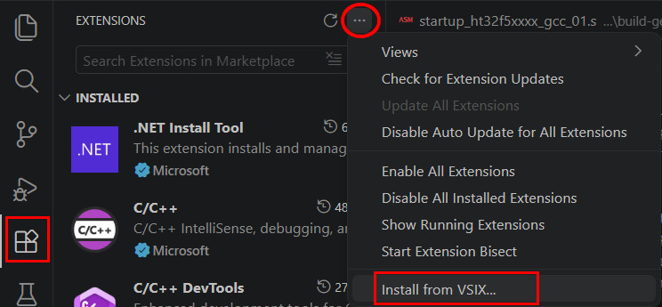
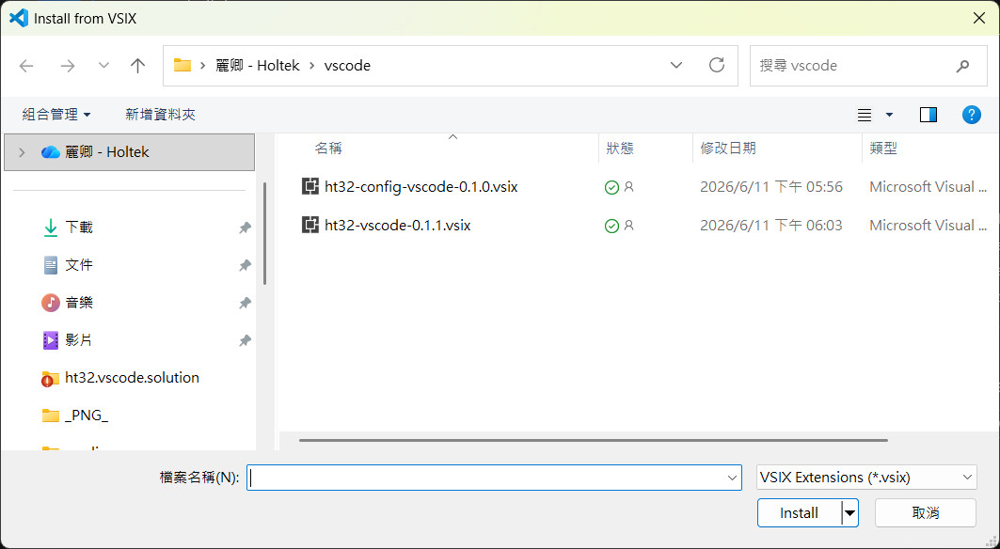
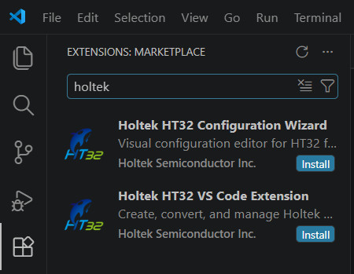
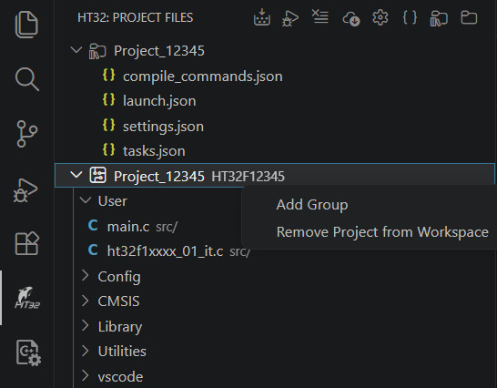
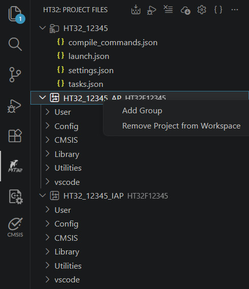
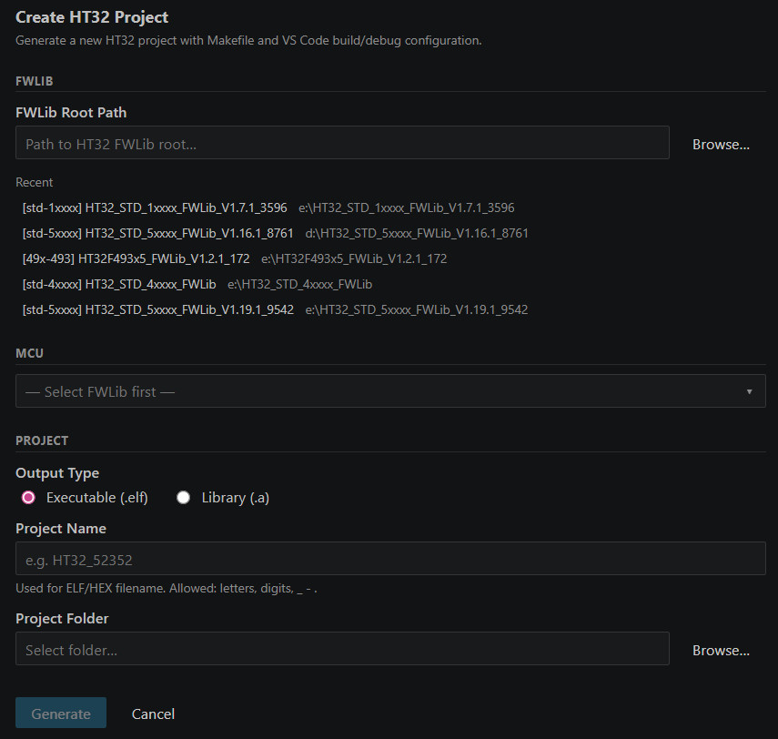
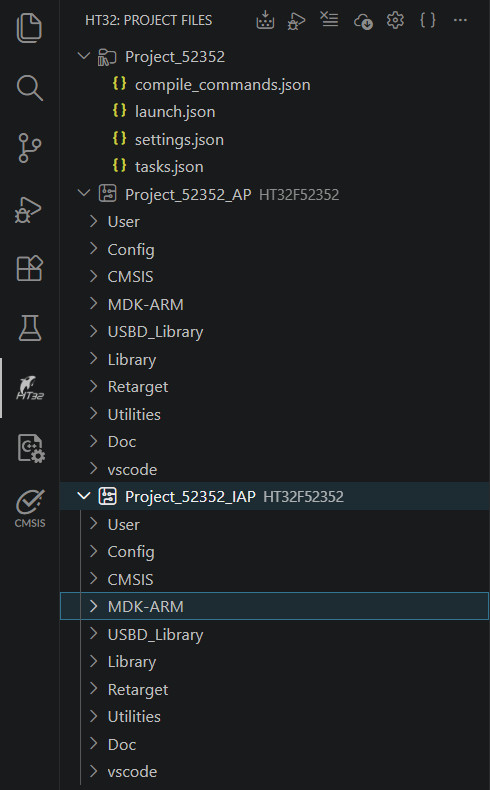
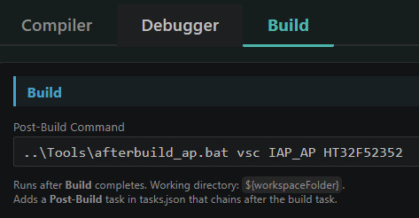
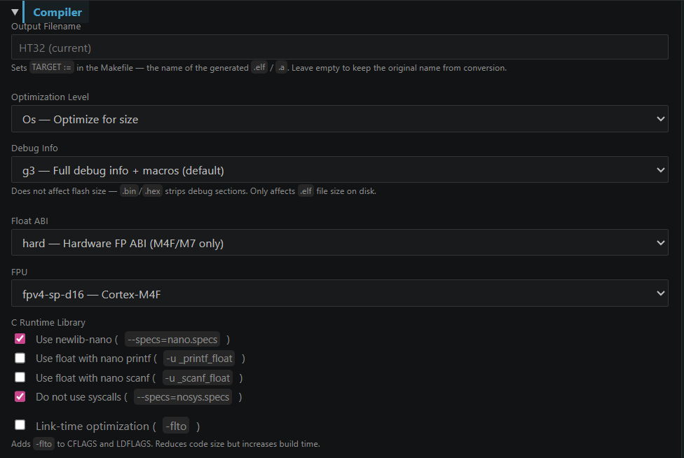
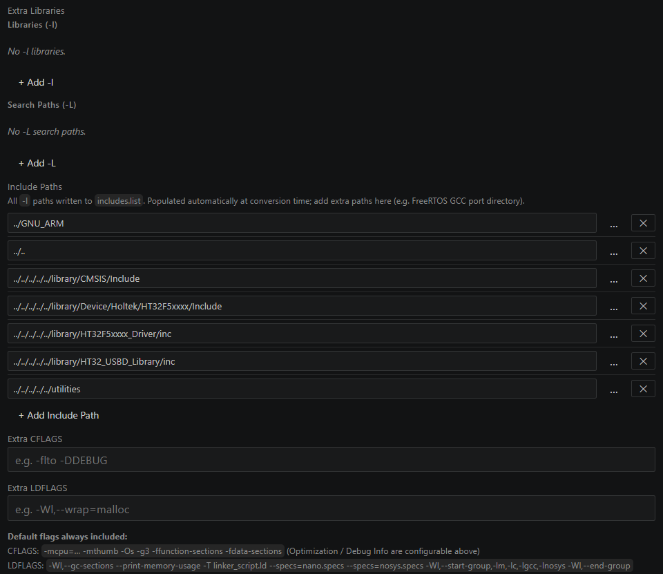

[中文使用手冊](README_TRAD.md) | [English](#holtek-ht32-vs-code-extension)

# Holtek HT32 VS Code Extension

A VS Code extension for **Holtek HT32** series Cortex-M microcontrollers (M0+/M3/M4). Converts Keil uVision and HT32-IDE projects to a Makefile workflow, or creates new projects from scratch — with one-click build, flash, and debug via the bundled OpenOCD and e-Link32 probe.

---

<br>

## Features

| Feature | Description |
|---------|-------------|
| **Create Project** | Wizard-driven project generator from HT32 FWLib (standard & 49x series) |
| **Convert uVision** | Import Keil `.uvprojx` / `.uvmpw` projects — Makefile, linker script, clangd config auto-generated |
| **Convert HT32-IDE** | Import one or more Eclipse CDT `.project`/`.cproject` project folders (multi-select supported) |
| **Build / Clean** | One-click or toolbar buttons; compound post-build task support |
| **Debug** | Cortex-Debug + bundled OpenOCD; Flash & Debug or Attach mode |
| **Download** | Download firmware via bundled OpenOCD + e-Link32 Pro/Lite |
| **Project Settings** | WebView panel for compiler flags, debug interface, post-build commands |
| **Project File Tree** | Source groups view with add/remove files and groups |
| **Configuration Wizard** | Visual editor for HT32 config files (`conf.h`, `usbdconf.h`, `startup.s`) — Keil-compatible wizard syntax |
| **clangd / IntelliSense** | Auto-generates `.clangd` and merged `compile_commands.json` |

---

<br>

## Requirements

| Item | Description |
|------|-------------|
| **OS** | Windows x64 |
| **Debug probe** | Holtek e-Link32 Pro or e-Link32 Lite; J-Link and ST-Link also supported |
| **FWLib** | Required; supports HT32F1xxxx / HT32F4xxxx / HT32F5xxxx / HT32F490x1 / HT32F491x3 / HT32F493x5 |

> **OpenOCD:** Bundled.<br>
> **GCC toolchain:** Auto-detected on startup; installed automatically via winget if not found, or set manually in settings.<br>
> **Extension dependencies:** [Cortex-Debug](https://marketplace.visualstudio.com/items?itemName=marus25.cortex-debug) and [Holtek Configuration Wizard](https://marketplace.visualstudio.com/items?itemName=holtek.ht32-config-vscode) are installed automatically.

---

<br>

## Installation

**Option A — From VSIX**

1. VS Code → Extensions → `...` → **Install from VSIX...**
2. Select `ht32-proj-assistant-x.x.x.vsix`

> **Note:** VS Code resolves extension dependencies from the Marketplace automatically.
> If a required dependency is not published on the Marketplace, the installation will fail.

<table><tr>
<td></td>
<td></td>
</tr></table>

---

<br>

**Option B — From Marketplace**

1. Search `Holtek HT32 VS Code Extension` in the Extensions view (searching `holtek` or `ht32` also works)
2. Click **Install**



---

<br>

## Interface Overview

After installation, the **HT32 icon** appears in the Activity Bar. Click it to open the HT32 panel.

**When no project is open:** shows **Create / Open / Convert** buttons, plus a **Recent Projects** list below for quick access.


---

<br>

**Toolbar buttons (visible when a project is loaded):**

| Button | Action |
|--------|--------|
| Build | Compile (runs make) |
| Debug | Start Cortex-Debug session via OpenOCD (Flash & Debug or Attach) |
| Clean | Delete the `build/` output directory |
| Download | Download firmware without starting a debug session |
| Settings | Open Project Settings |
| Generate Build & Debug Config | Regenerate `tasks.json` and `launch.json` |

The **`···` (More Actions)** menu also contains:

| Item | Action |
|------|--------|
| Create Project | Open the Create Project wizard (can be used while a project is open) |
| Open Project | Open a `.ht32vs` project file |
| Close Project | Close the currently loaded project |

---

<br>

**Project File Tree** shows source groups — the same group concept as Keil uVision.

<br>

Right-click menu:

| Target | Actions |
|--------|---------|
| Tree root (`.ht32vs`) | Rename Project File, Add Project |
| Sub-project node | Add Group, Remove Project |
| Group | Add Files to Group, Remove Group |
| File | Remove from Group, Delete File |

<br>
---

<br>

## Project File (.ht32vs)

Every HT32 project is associated with a **`.ht32vs` project file** (stored inside `HT32_VSCode/`). This file records which sub-project folders belong to the project and is created automatically after conversion or project creation.

### Opening a project

| Method | Description |
|--------|-------------|
| **Double-click `.ht32vs`** | Double-click a `.ht32vs` file in Explorer — opens the project directly |
| **Open Project** | Browse for a `.ht32vs` file via the welcome screen **Open** button, the `···` menu, or `HT32: Open Project` command |
| **Recent Projects** | Click any entry in the Recent Projects list (shown when no project is open) |

### Managing sub-projects

A `.ht32vs` file can list multiple sub-project folders (e.g. `Project_IAP` and `Project_AP`). You can add or remove entries at any time without re-converting.

| Action | How |
|--------|-----|
| **Add Project** | Right-click the root node → **Add Project** — select from available folders in the same location |
| **Remove&nbsp;Project** | Right-click a project node → **Remove Project** — removes it from the list (files on disk are not deleted). Not available when only one project remains. |

### Renaming a project

Right-click the root node in the Project Tree → **Rename Project File**. This renames the `.ht32vs` file on disk and updates the Recent Projects list automatically.


---

<br>

## Create a New Project

> Requires HT32 FWLib downloaded from the Holtek website.

1. HT32 panel → **Create Project**
2. Follow the wizard steps:

| Step | Content |
|------|---------|
| ① | Select the **HT32 FWLib root folder** |
| ② | Select the **MCU model** |
| ③ | Select output type: **Executable (.elf)** or **Library (.a)** |
| ④ | Enter the **project name** and output folder |



---

<br>

### Generated File Structure

```
MyProject/                 ← user-named project folder
├── .clangd                ← auto-generated on project open (clangd config)
└── HT32_VSCode/           ← VS Code workspace root
    ├── .vscode/
    │   ├── tasks.json
    │   ├── launch.json
    │   └── compile_commands.json
    ├── <projectName>.ht32vs
    └── <projectName>/     ← named from the project name entered in the wizard
        ├── Makefile
        ├── sources.list
        ├── *.json
        ├── src/           ← user source files
        │   ├── main.c
        │   ├── ht32fxxxx_it.c
        │   ├── system_ht32fxxxx.c
        │   ├── ht32fxxxx_conf.h
        │   └── ht32_op.c
        └── GNU_ARM/       ← generated GCC support files
            ├── startup_ht32fxxxx_gcc_xx.s
            ├── linker.ld
            ├── syscalls.c
            └── ht32_stack_analysis.c
```

To add a second project to the same workspace folder, run **Create Project** again while the workspace is open. When prompted, select **Yes** to add the new project to the currently open workspace. Each project is fully self-contained under its own `<projectName>/` folder.

---

<br>

## Convert a Keil uVision Project

1. Click **Convert uVision Project** in the HT32 panel
2. Select the `.uvprojx` (single project) or `.uvmpw` (multi-project workspace) file

For `.uvmpw`, **all sub-projects are converted at once**, each into its own folder named after the `.uvprojx` filename.

**Auto-generated:**
- `Makefile` (MCU, compiler flags, source files)
- Linker script (shared in `GNU_ARM/`): if Keil scatter file present, converted to `<scatter_name>.ld` (original filename with `.ld` extension); otherwise taken directly from FWLib (`linker.ld` for standard series, `<chip>_FLASH.ld` for 49x series)
- `startup_xxx_gcc.s` (converted from Keil startup, shared in `GNU_ARM/`)
- `compile_commands.json` / `tasks.json` / `launch.json`

**`.uvprojx` single-project** — output to `HT32_VSCode/GNU_ARM/` (shared files) + `HT32_VSCode/Project/` (Makefile & metadata)

**`.uvmpw` multi-project** — one folder per sub-project, named from the `.uvprojx` filename (e.g. `Project_IAP.uvprojx` + `Project_AP.uvprojx`):


```
<ProjectRoot>/
├── MDK_ARMv5/             ← original Keil projects
├── .clangd                ← auto-generated on project open (clangd config)
└── HT32_VSCode/           ← VS Code workspace root
    ├── .vscode/
    │   ├── tasks.json
    │   ├── launch.json
    │   └── compile_commands.json
    ├── GNU_ARM/           ← shared: startup .s, linker script, ht32_op.c, syscalls.c, ht32_stack_analysis.c
    ├── Project_IAP/       ← named from uvprojx filename
    │   ├── Makefile
    │   └── *.json
    └── Project_AP/
        ├── Makefile
        └── *.json
```

---

<br>

Conversion warnings (e.g. prebuilt `.lib` files that cannot be used with GCC) appear in the VS Code **Problems** panel.


---

<br>

## Convert an HT32-IDE Project

1. Click **Convert HT32-IDE Project** in the HT32 panel
2. Select one or more project folders containing `.project` / `.cproject` (Eclipse CDT format) — **multiple folders can be selected at once**

Each selected folder is converted into its own folder inside `HT32_VSCode/`, sharing a common `HT32_VSCode/GNU_ARM/` for startup, linker script, and generated C files. The generated folder structure and TreeView organization are identical to a uVision conversion.

---

<br>

## Build

- Click **Build** in the HT32 toolbar
- Or press **Ctrl+Shift+B** to run the default build task directly


<br>

A **Post-Build** command can be configured in Settings to run automatically after a successful build (e.g. CRC calculation). The working directory is `${workspaceFolder}` (= `HT32_VSCode/`, the VS Code workspace root). Sub-project folders such as `Project_xxx/build/` are referenced relative to this root.



---

<br>

## Clean

- Click **Clean** in the HT32 toolbar
- Deletes all compiled output under `HT32_VSCode/Project/build/` (or `HT32_VSCode/Project_xxx/build/` for multi-project)

---

<br>

## Download Firmware

> Requires Holtek e-Link32 Pro or e-Link32 Lite connected.

1. Confirm the e-Link32 is connected and the driver is working
2. Click **Download** in the HT32 toolbar
3. Firmware is flashed automatically; progress is shown in the Terminal


### Download Settings

Open **Settings** (toolbar) → **Debugger** tab:

| Setting | Options |
|---------|---------|
| Debug Interface | CMSIS-DAP (e-Link32) / J-Link / ST-Link |
| Erase Mode | Erase Sector (default) / Erase Chip / None |

---

<br>

## Debug

> **Cortex-Debug** is a dependency and is installed automatically.

### Full Debug Flow

1. Click **Debug** in the HT32 toolbar
2. The extension compiles, flashes, and starts an OpenOCD + GDB debug session

### Attach Mode (connect to an already-running target)

Use this when the target board is already running and you don't need to reflash.

1. Confirm the target board is powered and running
2. Press **F5** or open Run and Debug (**Ctrl+Shift+D**)
3. Select **HT32 OpenOCD Attach** from the dropdown

> Attach does not compile or flash — it connects directly via OpenOCD to the running target without resetting it.

| Mode | Description |
|------|-------------|
| HT32 OpenOCD Debug | Compile → Flash → Start debug session |
| HT32 OpenOCD Attach | Connect to running target without flashing |


---

<br>

## Stack Usage Analysis

The **HT32 Stack Usage Analysis** panel (in the Run & Debug view) updates automatically every time the debugger halts (breakpoint, step, manual pause). It is the GCC/OpenOCD equivalent of Keil's stack analysis window.

### Panel rows

| Row | Description |
|-----|-------------|
| **Target** | ELF filename (output name) |
| **Stack Top Addr (Start)** | Top of the stack region (highest address) |
| **Stack Bottom Addr (End/Limit)** | Bottom of the stack region (stack limit) |
| **Stack Size** | Total stack size |
| **Current Usage** | Stack bytes in use at the last debugger halt |
| **Peak Usage** | Highest stack usage recorded (requires watermark setup — see below) |
| **Peak Addr** | Address where peak usage was recorded |

### Enabling peak (watermark) tracking

By default, **Peak Usage** shows a reminder to enable watermark tracking. To display actual peak values:

1. Ensure `HTCFG_STACK_USAGE_ANALYSIS` is defined as `1` (e.g. in your project configuration header)
2. Call `StackUsageAnalysisInit(0)` once at startup (before the RTOS scheduler or main loop)

```c
#include "ht32_stack_analysis.h"

int main(void) {
    StackUsageAnalysisInit(0);   // fills unused stack with a known pattern for watermark tracking
    // ... rest of init
}
```

Without both steps the **Peak Usage** row shows a reminder instead of a value.

---

<br>

## Project Settings

Open via the **Settings** button in the HT32 toolbar. The panel has three tabs. Settings auto-save 3 seconds after any change and are stored in `HT32_VSCode/Project/project.settings.json` (or `HT32_VSCode/Project_xxx/project.settings.json` for multi-project).

### Compiler Tab

| Setting | Options |
|---------|---------|
| Output Filename | Custom output filename for the generated `.elf` / `.a` (leave empty to keep the converted name) |
| Optimization | `-O0` / `-O1` / `-O2` / `-O3` / `-Os` (default) / `-Og` |
| Debug Info | `-g3` (default, full debug) / `-g` (standard) / `-g1` (line numbers only) / `-g0` (none, for release) |
| Float ABI | `soft` (M0/M3) / `softfp` / `hard` (M4F) |
| FPU | `none` / `fpv4-sp-d16` (M4F) / `fpv5-sp-d16` (M7) / `fpv5-d16` (M7) |
| C Runtime Library | `nano` (newlib-nano) / `nosys` — can combine both |
| printf float | Enable floating-point printf (`-u _printf_float`) |
| scanf float | Enable floating-point scanf (`-u _scanf_float`) |
| LTO | Enable `-flto` |
| Libraries (-l) | Library names to link (`-lName`) |
| Search Paths (-L) | Library search directories (`-L"dir"`) |
| Include Paths | All `-I` paths written to `includes.list` — auto-populated at conversion; add extra paths here |
| Extra CFLAGS | Additional compiler flags, e.g. `-DDEBUG` |
| Extra LDFLAGS | Additional linker flags |




---

<br>

### Debugger Tab

| Setting | Options |
|---------|---------|
| Debug Interface | `CMSIS-DAP` (e-Link32) / `J-Link` / `ST-Link` |
| Adapter Serial | Specify probe serial (blank = auto) |
| Adapter Speed | Transfer rate in kHz (blank = interface default) |
| OpenOCD Debug Level | 0 = off / 1–3 = increasing verbosity |
| DFP Path | Custom DFP path for SVD auto-detection |
| SVD File | Peripheral register SVD file (blank = auto-detect) |
| Erase Mode | `erase_sector` (default) / `erase_chip` / `none` |
| Flash Loaders | Add external flash loaders (e.g. SPI Flash) |


---

<br>

### Build Tab

| Setting | Description |
|---------|-------------|
| Post-Build Command | Command to run after a successful build (working dir: `${workspaceFolder}` = `HT32_VSCode/`) |
| GCC Path | `arm-none-eabi-gcc` path (blank = auto-detect) — machine-wide |
| OpenOCD Path | OpenOCD path (blank = use bundled OpenOCD) — machine-wide |

Toolchain paths are stored in VS Code User Settings and shared across all projects.

---

<br>

## Configuration Wizard

The **Holtek Configuration Wizard** extension (installed automatically) provides a visual editor for HT32 firmware configuration files, compatible with Keil MDK Configuration Wizard syntax.

**Supported files:**

| File | Purpose |
|------|---------|
| `ht32fxxxx_conf.h` | Retarget (printf/scanf port, baudrate, library enable) |
| `system_ht32fxxxx_NN.c` | Clock (PLL, HSE/HSI, HCLK, WDT) |
| `ht32fxxxx_NN_usbdconf.h` | USB endpoint configuration |
| `startup_ht32fxxxx_NN.s` | Stack and heap size |

**How to open:**

- **Editor title button (recommended):** Open a supported `.h` / `.c` / `.s` file, then click the **Preview** button in the editor title bar. Click **Go to File** to switch back to text editing.
- **Right-click menu:** Right-click the file in Explorer → **Open in Holtek Configuration Wizard**
- **Command Palette:** `Ctrl+Shift+P` → **HT32: Open in Holtek Configuration Wizard**

**Control types:**

| Type | Description |
|------|-------------|
| Checkbox (`<q>`) | Toggle on/off |
| Dropdown (`<o>` with options) | Select from predefined list |
| Number (`<o>` with range) | Enter value within allowed range |
| Enable Section (`<e>`) | Master switch that enables/disables a group of settings |
| Heading (`<h>`) | Collapsible group |

Changes are written back to the source file immediately; only the modified value is updated — all comments and surrounding code are preserved.

---

<br>

## IntelliSense (clangd)

After conversion or project creation, the extension auto-generates:

- `.clangd` (project root, one level above `HT32_VSCode/`) — generated automatically on project open
- `.clangd` (FWLib root) — also generated on project open (minimal, `UnusedIncludes: None` only); ensures clangd does not show warnings in FWLib internal files (e.g. `utilities/`, `library/`)
- `.vscode/compile_commands.json` — merged for clangd


Recommended: install the **clangd** extension (`llvm-vs-code-extensions.vscode-clangd`) and disable the built-in C/C++ IntelliSense to avoid conflicts.

---

<br>

## Output Structure

After conversion or project creation:

```
<ProjectRoot>/
├── MDK_ARMv5/ (or src/)          ← original Keil project / user sources
├── .clangd                       ← auto-generated on project open (clangd config)
└── HT32_VSCode/                  ← VS Code workspace root
    ├── .vscode/
    │   ├── tasks.json
    │   ├── launch.json
    │   └── compile_commands.json ← merged for clangd
    ├── GNU_ARM/                  ← shared generated GCC support files
    │   ├── startup_xxx_gcc.s
    │   ├── <scatter_name>.ld     ← from Keil scatter; or linker.ld / <chip>_FLASH.ld from FWLib
    │   ├── ht32_op.c             ← uVision only
    │   ├── syscalls.c
    │   └── ht32_stack_analysis.c
    └── Project/                  ← Makefile & build metadata (Project_xxx/ for multi-project)
        ├── Makefile
        ├── sources.list
        ├── project.meta.json
        ├── project.settings.json
        └── build.meta.json
```

---

<br>

## Commands (Ctrl+Shift+P → "HT32")

| Command | Description |
|---------|-------------|
| `HT32: Create Project` | Open Create Project wizard |
| `HT32: Open Project` | Browse for and open a `.ht32vs` project file |
| `HT32: Convert uVision Project` | Import Keil `.uvprojx` / `.uvmpw` |
| `HT32: Convert HT32-IDE Project` | Import Eclipse CDT `.project` |
| `HT32: Build` | Run build task |
| `HT32: Download` | Download firmware |
| `HT32: Debug` | Start debug session |
| `HT32: Clean` | Clean build output |
| `HT32: Open Settings` | Open Project Settings |
| `HT32: Generate Build & Debug Config` | Regenerate `tasks.json` and `launch.json` |

---

<br>

## Supported Devices

141 HT32 devices across 6 series:

| Core | Series | Examples |
|------|--------|---------|
| Cortex-M0+ | HT32F5xxxx | HT32F52352, HT32F52341, HT32F0008 |
| Cortex-M0+ | HT32F5xxxx (extended) | HT32F61352, HT32F62030, HT32F67232 |
| Cortex-M3 | HT32F1xxxx | HT32F12345, HT32F12366 |
| Cortex-M4 | HT32F4xxxx | HT32F40316, HT32F45369 |
| Cortex-M4 | HT32F490x / 491x / 493x | HT32F49163, HT32F49395 |
| Cortex-M33 | HT32F675xx | HT32F67575, HT32F67595 |

Flash/download support (via bundled OpenOCD + HLM loaders) is available for ~100 devices. Devices without an MCU cfg file can still be built and debugged with a custom OpenOCD configuration.

---

<br>

## Bundled Assets

| Asset | Description |
|-------|-------------|
| `openocd/` | OpenOCD Windows x64 + ~90 HT32 MCU `.cfg` files + HLM flash loaders |
| `bin/win32-x64/make.exe` | GNU Make Windows x64 |
| `dfp/Holtek/HT32_DFP/` | CMSIS DFP (multiple versions) — SVD files for peripheral register view |
| `templates/GNU_ARM/` | Startup `.s`, `syscalls.c`, `ht32_stack_analysis.c` templates (linker script is sourced from FWLib at conversion time) |

---

<br>

## Third-Party Licenses

See `THIRD_PARTY_LICENSES.md` for license information for bundled components (OpenOCD, GNU Make, HT32 DFP, fast-xml-parser).

---

<br>

## License

MIT — see `LICENSE`
